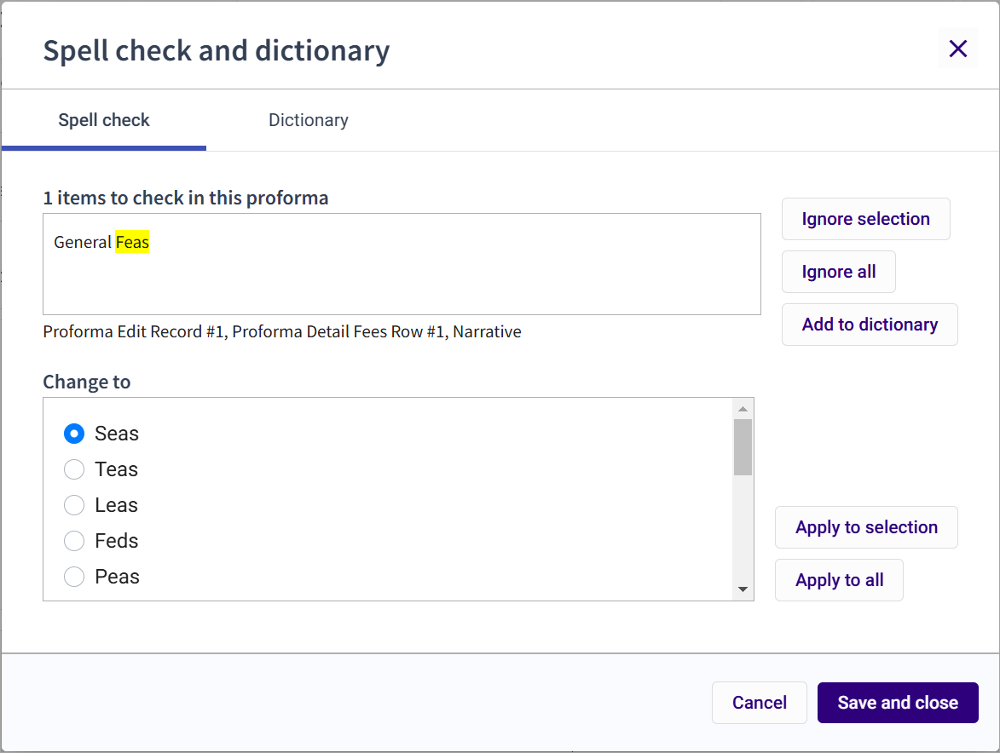

# Spell Check

## About Spell Check

To prevent clients from seeing spelling errors in printed proformas and bills, a spell check tool is available to check for errors in proforma detail.

&#x20;

## Spell Check Proforma

Do the following to spell check proforma detail:

1. Locate the proforma containing funds on the Proforma list.
2. Click the proforma number to access the [Proforma Details](../../getting-started/navigating-3e-proforma-walkthrough/navigating-the-proforma-detail-view.md#navigating-the-proforma-detail-view) view.
3. Select **Spell check** from the Proforma-level **Action** menu, the Spell check and dictionary window displays.
4. Use the options in the spell check tool to select and apply a correct spelling of a word, skip a word, or add a new word to the tool's dictionary.
5. Click **Save and close** when done.

&#x20;

## Spell Check Form and Field Definitions

The spell check tool is used to scan proforma detail for spelling errors.

| **Field Name**                      | **Description**                                                                                                                                                                                                                         |
| ----------------------------------- | --------------------------------------------------------------------------------------------------------------------------------------------------------------------------------------------------------------------------------------- |
| **Spell check**                     |                                                                                                                                                                                                                                         |
| **Items to check in this proforma** | Displays the detected spelling error. The spell check tool also gives the location of the spelling error in the Proforma Details form.                                                                                                  |
| **Ignore Selection**                | Click to keep the highlighted word as it is currently spelled and continue with the spell check.                                                                                                                                        |
| **Ignore All**                      | Click to keep the highlighted word, and other instances of the word in the proforma, as it is currently spelled. The spell check tool will continue with its search.                                                                    |
| **Add to dictionary**               | Click to add the word to your dictionary. The word or name will be added to your dictionary so the next time you perform a spell check your saved words and names will be included in identifying misspellings in the current proforma. |
| **Change to**                       | Choose the correct spelling from the list of options.                                                                                                                                                                                   |
| **Apply to selection**              | Click to update the highlighted spelling error using the spelling selected in the **Change to** list. The spell check will continue to the next detected spelling error.                                                                |
| **Apply to all**                    | Click to correct the highlighted word throughout the entire proforma based on the **Change to** selection.                                                                                                                              |
| **Dictionary**                      |                                                                                                                                                                                                                                         |
| **Dictionary list**                 | Displays a custom dictionary list.                                                                                                                                                                                                      |
| **Edit**                            | Click to edit a listed word.                                                                                                                                                                                                            |
| **Delete**                          | Click to remove a word from the dictionary.                                                                                                                                                                                             |
| **New word**                        | Type text in this field to add a new entry to the dictionary list                                                                                                                                                                       |
| **Add**                             | Click to save the new word to the dictionary list                                                                                                                                                                                       |
