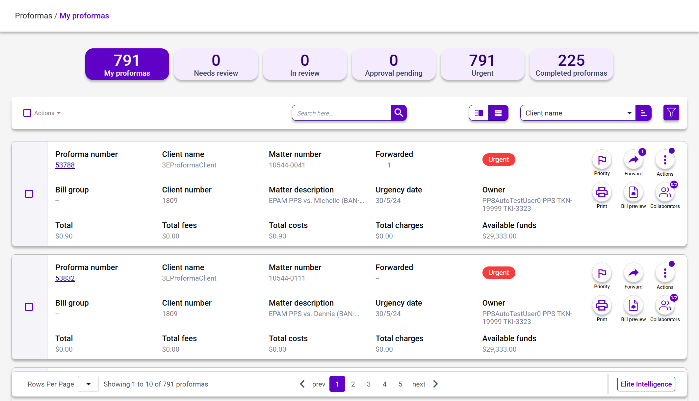

# Proforma Lists Form and Field Definitions

The **Proforma List** view consists of the following. Available options (e.g., list Categories) will vary based on your role (e.g., Approver).

**Note**: The list may display proformas in [Card or List view](../getting-started/standard-features-and-navigation/lists.md#list-view-types). The default view is determined by the [3E Proforma settings](../#3e-proforma-settings).

| **Field Name**                                                                                              | **Description**                                                                                                                                                                                                                                                                                                                                                                                                                                                                                                                                                                                                                                                                                                                                                                                                                                                                                                                                                                                           |
| ----------------------------------------------------------------------------------------------------------- | --------------------------------------------------------------------------------------------------------------------------------------------------------------------------------------------------------------------------------------------------------------------------------------------------------------------------------------------------------------------------------------------------------------------------------------------------------------------------------------------------------------------------------------------------------------------------------------------------------------------------------------------------------------------------------------------------------------------------------------------------------------------------------------------------------------------------------------------------------------------------------------------------------------------------------------------------------------------------------------------------------- |
| **Categories**                                                                                              |                                                                                                                                                                                                                                                                                                                                                                                                                                                                                                                                                                                                                                                                                                                                                                                                                                                                                                                                                                                                           |
| **My proformas**                                                                                            | This displays proformas on which the current timekeeper needs to act. This list will change, as proformas will be added and removed from individual work lists. This list will change when the user takes actions on a proforma such as **Submit** or **Mark as Complete**, and background actions such as proforma collaboration changes may alter the list entries.                                                                                                                                                                                                                                                                                                                                                                                                                                                                                                                                                                                                                                     |
| **My approvals**                                                                                            | This category only displays for users that are assigned the _3EProformaApproverRole_ in 3E. It displays proformas that are awaiting approval from the current timekeeper. This list will change when the user takes actions on a proforma to Approve or Reject the proformas, and if the firm assigns approvals to everyone with the _3EProformaApproverRole_, then if another approver acts on the proforma, the changes will be reflected for all approvers.                                                                                                                                                                                                                                                                                                                                                                                                                                                                                                                                            |
| **Needs review**                                                                                            | This displays proformas the timekeeper currently is associated with but have not been opened to the proforma detail view.                                                                                                                                                                                                                                                                                                                                                                                                                                                                                                                                                                                                                                                                                                                                                                                                                                                                                 |
| **In review**                                                                                               | This displays proformas that have been opened or edited by the current timekeeper.                                                                                                                                                                                                                                                                                                                                                                                                                                                                                                                                                                                                                                                                                                                                                                                                                                                                                                                        |
| **Approval pending**                                                                                        | This displays proformas submitted by the current billing attorney that require approval based on configuration settings for write-down threshold(s). If the firm does not have a configured write-down threshold(s), the proformas will move to the **Completed proformas** category upon **Submit**, **Mark as complete** or **Defer** action.                                                                                                                                                                                                                                                                                                                                                                                                                                                                                                                                                                                                                                                           |
| **Urgent**                                                                                                  | 
This displays proformas whose proforma date has met or exceeded the Urgency Date.

<strong>Note</strong>: The Urgency Date is a calculated date based on settings in 3E and the proforma generation date.
                                                                                                                                                                                                                                                                                                                                                                                                                                                                                                                                                                                                                                                                                                                                                                                     |
| **Completed proformas**                                                                                     | This displays proformas that have been Submitted by the billing timekeeper, Marked as complete by a proforma editor, Deferred by the billing timekeeper, and Approved by an approver.                                                                                                                                                                                                                                                                                                                                                                                                                                                                                                                                                                                                                                                                                                                                                                                                                     |
| **Proforma List Options**                                                                                   |                                                                                                                                                                                                                                                                                                                                                                                                                                                                                                                                                                                                                                                                                                                                                                                                                                                                                                                                                                                                           |
| **Select all**                                                                                              | 
Click this check box to select all proformas on the page. Deselect this check box to clear all selections.

<strong>Note</strong>: When multiple proformas are selected, the number of selected proformas displays above this check box.
                                                                                                                                                                                                                                                                                                                                                                                                                                                                                                                                                                                                                                                                                                                                                      |
| **Actions**                                                                                                 | 
Click this Action menu and select an action to perform on multiple selected proformas.

<strong>Note</strong>: Actions available in the menue vary by assigned role (i.e., Timekeeper, Billing Attorney, or Approver). See <a href="../Appendix-A---Proforma-Action-Availability-by-Role.md#appendix-a---proforma-action-availability-by-role">Appendix A - Proforma Action Availability by Role</a> for details.
                                                                                                                                                                                                                                                                                                                                                                                                                                                                                                                                                                             |
| **Search**                                                                                                  | 
Type search criteria in this field to narrow down the proforma list. You can do a quick search on the following fields:
<ul><li>Client name</li><li>Matter number</li><li>Matter name</li><li>Matter description</li><li>Proforma Number</li><li>Bill Group</li></ul>
<strong>Note</strong>: You can enter a partial name or number and 3E Proforma will search the current list for records that have a match. Click the <strong>X</strong> in this field to clear search criteria.
                                                                                                                                                                                                                                                                                                                                                                                                                                                                                                          |
| 
<strong>Sort</strong>

   | Select criteria to use to sort the list. Click the **Sort** icon to order this list in asending or descending order. By default, the list of is sorted by client’s name from A-Z .                                                                                                                                                                                                                                                                                                                                                                                                                                                                                                                                                                                                                                                                                                                                                                                                                        |
| 
<strong>Filter</strong>

 | Click the **Filter** icon to limit the number of proformas displayed in the Proforma list by using the Filter sidebar. See [Filters](../Getting-Started/Standard-Features-and-Navigation/Filters.md#filters) for further details.                                                                                                                                                                                                                                                                                                                                                                                                                                                                                                                                                                                                                                                                                                                                                                         |
| **Proforma List**                                                                                           |                                                                                                                                                                                                                                                                                                                                                                                                                                                                                                                                                                                                                                                                                                                                                                                                                                                                                                                                                                                                           |
| **Select**                                                                                                  | Select this check box to flag this proforma for a batch action.                                                                                                                                                                                                                                                                                                                                                                                                                                                                                                                                                                                                                                                                                                                                                                                                                                                                                                                                           |
| **Lock icon**                                                                                               | Displays when a proforma is opened by another user. See [Icon Legend](../Getting-Started/Navigating-3E-Proforma---Walkthrough/Icon-Legend.md#icon-legend) for further details.                                                                                                                                                                                                                                                                                                                                                                                                                                                                                                                                                                                                                                                                                                                                                                                                                            |
| **Proforma number**                                                                                         | Click to view proforma details. For a Group proforma, a “Group” prefix displays.                                                                                                                                                                                                                                                                                                                                                                                                                                                                                                                                                                                                                                                                                                                                                                                                                                                                                                                          |
| **Client Name**                                                                                             | Displays the client name associated with the proforma.                                                                                                                                                                                                                                                                                                                                                                                                                                                                                                                                                                                                                                                                                                                                                                                                                                                                                                                                                    |
| **Matter number**                                                                                           | Displays the matter number and the matter description associated with a single matter proforma or a lead matter for a group proforma.                                                                                                                                                                                                                                                                                                                                                                                                                                                                                                                                                                                                                                                                                                                                                                                                                                                                     |
| **Forwarded**                                                                                               | 
The Forwarded badge shows how many times the proforma has been forwarded. Hover the cursor over the badge to display timekeepers to whom the proforma has been forwarded. The same information displays in the proforma list for the received proforma after it has been forwarded.

                                                                                                                                                                                                                                                                                                                                                                                                                                                                                                                                                                                                                                   |
| **Status**                                                                                                  | Displays the status(e.g., Urgent) and sub-status of the proforma.                                                                                                                                                                                                                                                                                                                                                                                                                                                                                                                                                                                                                                                                                                                                                                                                                                                                                                                                         |
| **Bill group**                                                                                              | Displays the bill group to which the group proforma belongs. For a proforma that is not a part of a group, dashes (--)  display.                                                                                                                                                                                                                                                                                                                                                                                                                                                                                                                                                                                                                                                                                                                                                                                                                                                                          |
| **Client Number**                                                                                           | Displays the client name associated with the matter.                                                                                                                                                                                                                                                                                                                                                                                                                                                                                                                                                                                                                                                                                                                                                                                                                                                                                                                                                      |
| **Matter Name**                                                                                             | Displays the name of the matter for which the proforma is being created.                                                                                                                                                                                                                                                                                                                                                                                                                                                                                                                                                                                                                                                                                                                                                                                                                                                                                                                                  |
| **Urgency date**                                                                                            | Displays the date when the proforma becomes due. Urgency date is calculated based on a setting in 3E Override / Set System Options and the Proforma date.                                                                                                                                                                                                                                                                                                                                                                                                                                                                                                                                                                                                                                                                                                                                                                                                                                                 |
| **Total**                                                                                                   | The **Total** attribute displays the total bill amount of the proforma.                                                                                                                                                                                                                                                                                                                                                                                                                                                                                                                                                                                                                                                                                                                                                                                                                                                                                                                                   |
| **Total fees**                                                                                              | 
The <strong>Total fees</strong> attribute displays the total bill amount of the fees.

 
                                                                                                                                                                                                                                                                                                                                                                                                                                                                                                                                                                                                                                                                                                                                                                                                                                                                                                      |
| **Total costs**                                                                                             | The **Total costs** attribute displays the total bill amount of the costs.                                                                                                                                                                                                                                                                                                                                                                                                                                                                                                                                                                                                                                                                                                                                                                                                                                                                                                                                |
| **Total charges**                                                                                           | The **Total charges** attribute displays the total bill amount of the charges.                                                                                                                                                                                                                                                                                                                                                                                                                                                                                                                                                                                                                                                                                                                                                                                                                                                                                                                            |
| **Available funds**                                                                                         | **Available funds** displays the sum of unapplied billed on account, unapplied credits, and trust.                                                                                                                                                                                                                                                                                                                                                                                                                                                                                                                                                                                                                                                                                                                                                                                                                                                                                                        |
| **Priority flag**                                                                                           | 
Click the priority flag to toggle the proforma between a priority and non-priority status. A white flag indicates the default non-priority state.

<strong>Note</strong>: In Card view, this field displays as a Quick Action Button
                                                                                                                                                                                                                                                                                                                                                                                                                                                                                                                                                                                                                                                                                                                                                          |
| **Quick Action Buttons**                                                                                    | 
In Card view, the following actions buttons display:
<ul><li>Set Priority</li><li>Forward</li><li>Print Proforma</li><li>Bill Preview</li><li>Collaborators</li></ul>
<strong>Note</strong>: The <strong>Collaborator</strong> button displays a badge that shows the total number of collaborators and the how many have completed their edits. The first number is how many collaborators have completed the proforma edits, the second number is total number of collaborators. Click the <strong>Collaborators</strong> button to see the details.

<strong>Note</strong>: In Grid view, these actions area available on the Actions menu.
                                                                                                                                                                                                                                                                                                                                           |
| **Actions Menu**                                                                                            | 
Click the <a href="../Getting-Started/Navigating-3E-Proforma---Walkthrough/Icon-Legend.md#icon-legend">Action menu</a> and select an action to perform on an individual proforma. Actions available on this list are dependent on the active Proforma List view. The Print Proforma, Bill Preview, and Collaborators actions are only available in the Action menu in Grid view. In Card view these action are available as Action buttons on the proforma.

<strong>Note</strong>: Actions available in the menu vary by assigned role (i.e., Timekeeper, Billing Attorney, or Approver). See <a href="../Appendix-A---Proforma-Action-Availability-by-Role.md#appendix-a---proforma-action-availability-by-role">Appendix A - Proforma Action Availability by Role</a> for details.

<strong>Note</strong>: Action menus apply user/role security. Users with restricted access will not see the following proforma-level actions in this menu: Add Adjustment, Add Cost, and Add Fee.
 |

&#x20;
